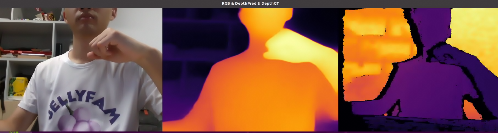

# Prerequisites

## Hardware

- Jetson Orin NX 8GB or higher
- Intel Realsense D435i

## Software

- JetPack 5.1.1
- OpenCV 4.10.0-dev with CUDA: YES
    - installation guide: https://qengineering.eu/install-opencv-on-jetson-nano.html
- CUDA 11.4.315
- cuDNN 8.6.0.166
- TensorRT 8.5.2.2
- pyrealsense2 2.55.1.6486

# Example Usage

## Cloning the Repository

``` bash
git clone https://github.com/kyrie2to11/Depth-Anything-for-Jetson-Orin-Python.git
```

## Build the Tensor RT engine 
``` bash
cd path/to/Depth-Anything-for-Jetson-Orin-Python
python export.py --weights_path="./ckpt" --save_path="exported_models" --input_size=364 # This will build the Tensor RT engine in the `exported_models` directory.
```

## Running the Live Stream Demo
``` bash
cd path/to/Depth-Anything-for-Jetson-Orin-Python
python depth_realsense.py --trt_engine_path='./exported_models/depth_anything_vits14_364.trt' --stream
```

## Output Shortcut
